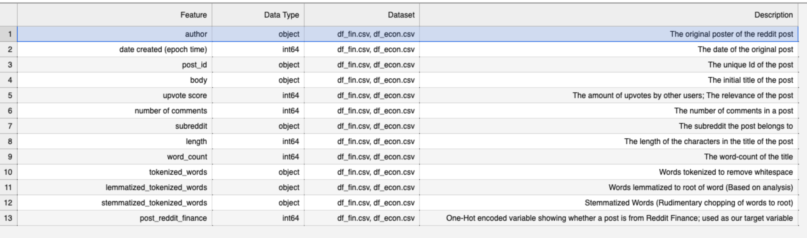
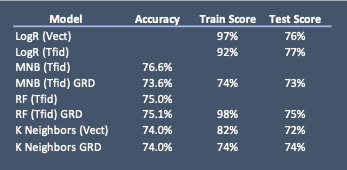
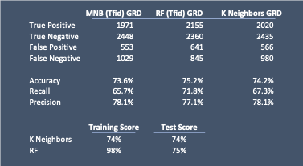

#  Project 3: Web APIs & NLP

# Project 3- NLP/API Modeling Project

## Problem Statement

You are a analyst of a market research team at LSB Industries that has been tasked to introduce the team to machine learning programming, and as an teaching exercise, you are looking to predict which subreddit a post belongs too. The chosen subreddits for this exercise are R/Finance and R/Economics. The data approach would be reproduceable for further projects utilizing python and reddit and is a beginning stage of your company's move to social media analytics.

The project is expected to show a classical modeling approach, and would assist in solving the problem case of your company being unable to predict social media data.

## Background

Reddit is a social media tool that draws in over over [430](https://en.wikipedia.org/wiki/Reddit) million users around the world on a monthly basis, who meet in forums called "subreddits", which are tailored to whatever interest brought them there. For example, subreddits like R/Dating Advice, or R/Personal Finance help users congregate, ask questions, and discuss new information. Some subreddits are more video based in nature, catering to those who just want to watch videos or post memes.

Reddit's works like a bulletin board system, where users "upvote" or comment on certain topics, contributing to the discussion and pushing the post up higher on the bulletin board. Posts with the most upvotes are pushed to the front page of the site, before being recycled to the background after 24 hours, leading to a continous inflow of new content.

Reddit's reach and content serves as an opportunity for companies to draw in significant amounts of qualitative text-based data, and siloed extremely well, allowing for content to be very specific.

## Data Background

* [`reddit_posts.csv`](./Data/reddit_posts.csv): Cleaned reddit posts from Reddit Finance and Reddit Economics subreddits;([Finance source](https://www.reddit.com/r/finance/)  | [Economics source](https://www.reddit.com/r/economics/)))

The data set contains 20,000 posts from the Reddit Finance and Reddit Economics subreddits. These posts are text_only, and largely cover news, events, and discussion regarding economic and financial news around the world. A detailed look at the data is below:

## Data Dictionary

## Model Setup and Evaluation

Over the course of this project we ran several different models to ascertain if any of them were a stronger predicter of our target variable.
    
**Some main assumptions prior to modeling:**
    
- Null Hypothesis is .5 or 50% accuracy, as we are trying to predict between to subreddit data samples that are identical in size.

- Our dependent variable is whether or not a post belongs to the Finance subreddit.

- Our independent variable is the text body from the title of the post, vectorized and cleaned using a Vectorizer

**Tested Models:**

- Logistic Regression

- Multinomial Naive Bayes

- Random Forest

- KNN- Neighbors

The overall scoring of these models is listed below. Please note the following acroynms:

- GRD = Grid-searched
- Vect= Count Vectorized
- Tfid= Tfidf Vectorized
- LogR = Logistic Regression
- MNB = Multinomial Naive Bayes
- RF - Random Forest

- Across all models, we made accurate predictions that were above our Null Hypothesis. Therefore, we will accept the model we choose. 

- All models were vectorized as a base assumption, while we did 3 gridsearches to determine the best parameters for our Multinomial, Random Forest, and K Neighbors models.

- There is overfitting that is consistent across most models, which lends some indication that we can further improve our modeling.

## Our Model Choice and Final Conclusions

As we were in the process, our choice came down to two models. Our Tfidf vectorized K-neighbors (with grid search), or Tfidf vectorized Random Forest (with grid search).

**Ultimately, we chose our K-neighbors model, for one primary reason:**

- Our random forest is severely overfit (98% train score vs. 75% test score). Conservatively, the K-Neighbors is more appealing as both score 74%, meaning we have a greater degree of fit on unseen data.

However, we recognize that K-neighbors, while a good model, has limitations that may necessitate further exploration into the other models. 

For one, there is no ability to pull feature coefficients in K-Neighbors. This may limit some analysis, given we can't see how individual words are influencing the model. As well, The recall scoring -- Our ability to predict true positives, is significantly lower than the other models. This would mean that our model doesn't do as good of a job predicting if a post belongs to Reddit Finance. These factors alone give us some degree of pause in being fully reliant on the model.

## Recommendations

Recommendations wise, we suggest the following improvements be made to the model, as they wil improve our analytics potential:

**Add reddit comments from the respective subreddits to the model flow, so that we can evaluate both at once:**

- We were not able to draw in comment data given time constraints in this project, but that doesn't dimish the analytics potential that exists there. In fact, it can be argued that even more information can be drawn them. The model if fairly reproducible in it's current state, so modifications using existing code can be completed relatively quickly once the API pull is created.

**Code that allows one to search for all mentions of a specified word and pull out the most upvoted posts and comments:**

- Reddit it built on an upvote system, and many information based subreddits will draw the most insightful information and data up to the top. Given the nature of our market research department, implementing data extraction processes that allow for us to filter information by specific words or phrases can give us a better ability to catelog immediate information that may be business-critical.

**Reproducible sentiment analysis given a beginning date. (Capturing and evaluating most recent posts)**

- Sentiment analysis is a potential boon for our company, and can help us see how customers are responding to advertising campaigns, competitor practices, and cultural and environmental shifts. The development of a sentiment analysis that allows us to acquire recent information can possibily give us an operational edge over the rest of the market.
